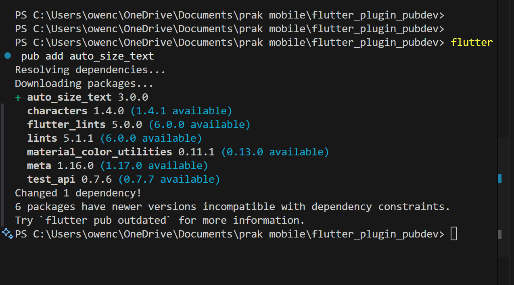
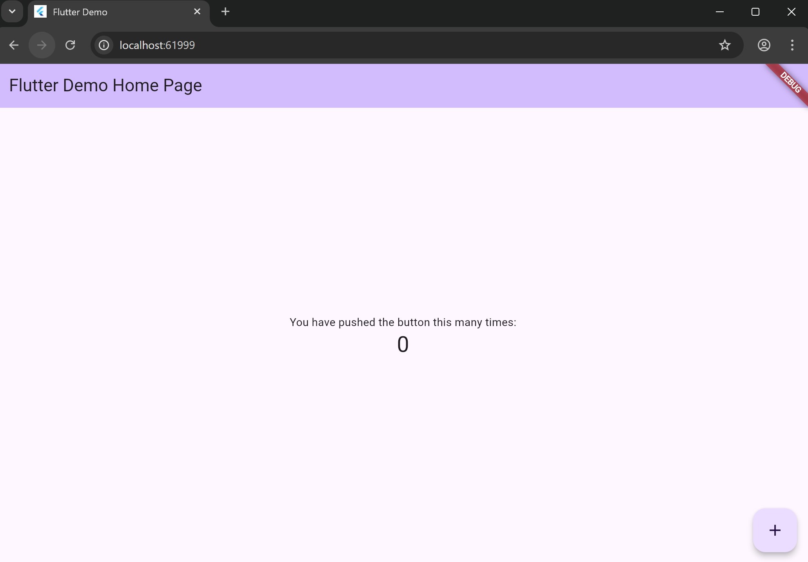
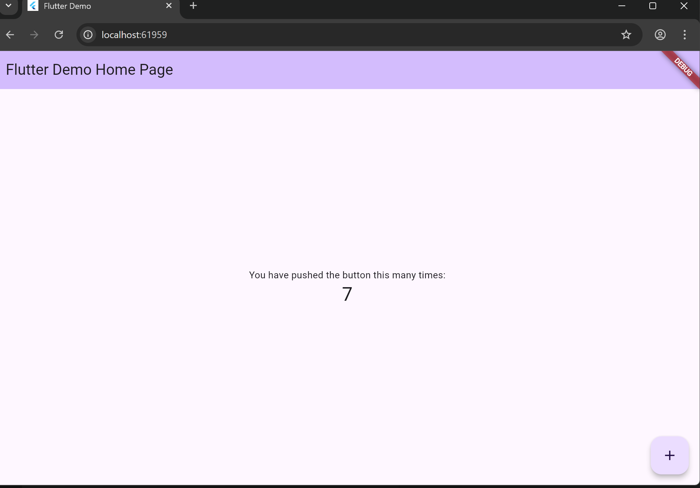
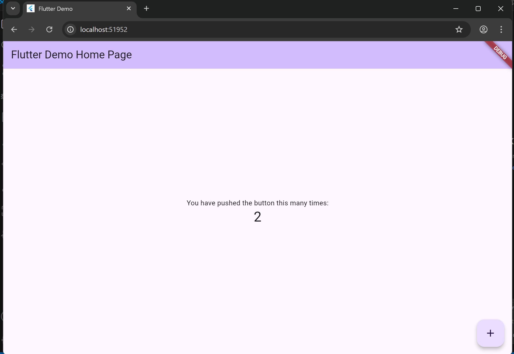
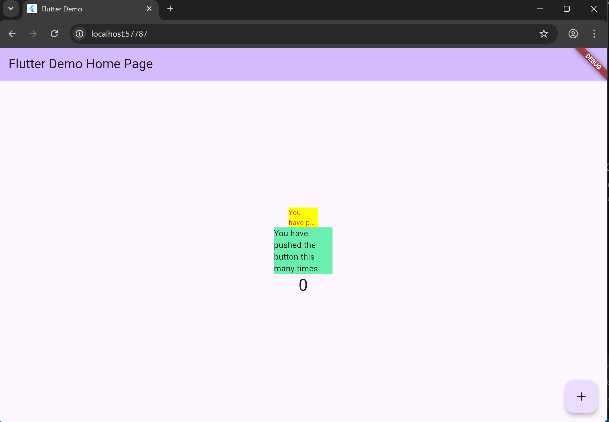

# flutter_plugin_pubdev

A new Flutter project.

## Getting Started

langkah 2 : menambahkan pluggin
Saya menambahkan plugin auto_size_text menggunakan perintah:
bash : flutter pub add auto_size_text

langkah 3 :membuat widget baru yang nantinya akan digunakan untuk menampilkan teks dengan gaya khusus sesuai keinginan kita.

langkah 4 :agar teks dapat mengatur ukuran font secara otomatis menggunakan plugin auto_size_text.

langkah 5 : agar widget RedTextWidget bisa menerima input teks dari luar melalui parameter text.

langkah 6 : untuk menampilkan dan membandingkan hasil antara widget teks kustom (RedTextWidget) dan widget teks bawaan Flutter (Text).

